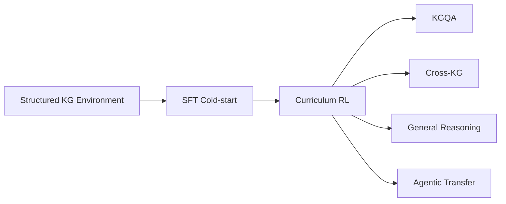

# Agentic-RL

> 构建面向知识图谱问答（KGQA）的 **Structured Agentic Environment**，通过 **SFT cold-start** 与 **Curriculum RL** 训练可验证的结构化检索、工具交互和多步推理能力；提升 KGQA 与跨知识图谱泛化表现，并评估其向通用推理和跨环境 Agentic 推理的迁移能力。

## 项目概述

本项目将知识图谱从静态知识源转化为可交互、可执行、可验证的 Agent 环境。模型在多轮交互中自主选择关系、探索实体、获取证据、回溯纠错并生成答案。

研究路线包括：

1. **Structured Agentic Environment**：定义明确的状态、动作、观察、终止条件与规则验证；
2. **SFT cold-start**：用少量、多样、经执行验证的轨迹建立工具使用和基础探索能力；
3. **Curriculum RL**：研究静态、反向和基于策略成功率的课程，训练长程检索与决策；
4. **能力评测**：分别验证 KGQA、跨 KG、通用推理和跨环境 Agentic transfer。



## 当前阶段

当前重点是**跑通相关工作的核心流程并提炼经验**。每个项目参考其论文和官方代码独立准备环境、数据、训练与评测，只选择 1–2 个最能代表核心方法的实验；不要求复现完整主表、全部数据集或所有消融。

复现结论将用于确定本项目的环境接口、cold-start 数据、reward、curriculum 和迁移评测方案；现阶段不预设单一组件的创新性或有效性。

## 相关项目

| 项目 | 核心关注点 | 论文 | 代码 |
| --- | --- | --- | --- |
| Search-R1 | 多轮搜索与 outcome-based RL | [PDF](related-papers/search-r1.pdf) | [仓库](related-projects/search-r1) |
| Logic-RL | 可验证逻辑 RL 与推理迁移 | [PDF](related-papers/logic-rl.pdf) | [仓库](related-projects/logic-rl) |
| ToG | KG beam exploration | [PDF](related-papers/tog.pdf) | [仓库](related-projects/tog) |
| PoG | 自适应规划、反思与回溯 | [PDF](related-papers/pog.pdf) | [仓库](related-projects/pog) |
| RoG | relation-path planning 与 SFT | [PDF](related-papers/rog.pdf) | [仓库](related-projects/rog) |
| KnowCoder-A1 | SFT cold-start 与 reward curriculum | [PDF](related-papers/knowcoder-a1.pdf) | [仓库](related-projects/knowcoder-a1) |
| GraphWalker | 合成轨迹与阶段式 SFT | [PDF](related-papers/graphwalker.pdf) | [仓库](related-projects/graphwalker) |
| SIE | 结构化环境与通用推理迁移 | [PDF](related-papers/sie.pdf) | [仓库](related-projects/sie) |
| ISP-KGR | 交互式语义解析与过程奖励 | [PDF](related-papers/isp-kgr.pdf) | [仓库](related-projects/isp-kgr) |
| KG-R1 | 多轮 KG-RL 与跨 KG 迁移 | [PDF](related-papers/kg-r1.pdf) | [仓库](related-projects/kg-r1) |
| EoG | 自主探索与 path-refined reward | [PDF](related-papers/eog.pdf) | [仓库](related-projects/eog) |
| Temp-R1 | 时序 KG 与 reverse curriculum | [PDF](related-papers/temp-r1.pdf) | [仓库](related-projects/temp-r1) |

## 文档

| 文档 | 内容 |
| --- | --- |
| [文档导航](docs/README.md) | 阅读顺序与维护规则 |
| [研究计划](docs/research-plan.md) | 研究目标、问题、方法与证据边界 |
| [复现计划](docs/reproduction-plan.md) | 12 个项目的详细复现步骤与价值分析 |
| [任务清单](docs/tasks.md) | 当前阶段、优先级与完成状态 |
| [前期资料](resources/README.md) | 历史研究和工程笔记索引 |

## 仓库结构

```text
Agentic-RL/
├── AGENTS.md              # Agent 工作规范
├── README.md              # 项目总览
├── docs/                  # 正式研究、复现与任务文档
├── resources/             # 前期研究和工程笔记
├── related-papers/        # 相关论文 PDF
└── related-projects/      # 固定官方 commit 的 Git submodule
```

`related-projects/` 中的仓库以 Git submodule 管理，保留独立提交历史和官方远端，默认作为参考与复现对象，不直接承载本项目实现。克隆本项目时使用：

```bash
git clone --recurse-submodules git@github.com:PursuitYP/Agentic-RL.git
```

已有工作树可执行 `git submodule update --init --recursive` 补全相关项目。

## 运行约定

- GPU 节点不联网，模型、数据、依赖、wheel 和容器需提前准备；
- 新增数据、环境和复现资产统一存放在 `/mnt/shared-storage-gpfs2/wenxiaoyu-gpfs02/yupeng/agentic-rl/`，具体结构见复现计划；
- 论文原始 backbone 作为配置参考；其余训练与本地推理默认使用 `/mnt/shared-storage-user/wenxiaoyu/models/Qwen2.5-7B-Instruct`；
- 需要 LLM API 时使用 `gpt-5`，并记录与论文原模型的差异；
- 密钥和服务地址从本地 `.env` 读取，不提交到 Git；
- checkpoint、日志和缓存不提交到仓库，并及时清理无保留价值的中间产物。

## 状态

项目处于前期研究与相关工作复现阶段。规划、实现和实验结果将持续记录；任何性能或迁移结论均以完成的可重复实验为准。
